# **CADLasso**
Easily import real-world geometry into Fusion 360

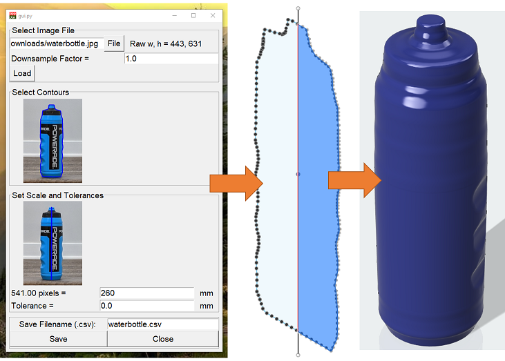

## Installation
Download files: `git clone https://github.com/njwidmann/CADLasso`

Install libraries:  `pip install requirements.txt`

**Tested only on Windows 10 so far**

## Usage
#### Start Python App
 `python3 gui.py`
 
#### Load Image File

- Press "File" to select an image file.
- You can choose to downsample (resize) the image (e.g entering 4 will downsample image to 1/4 of original size).
- Press "Load" to load the image into CADLasso
- After you press "Load", the original (not downsampled) image dimensions will appear next to the file location
- You can adjust the downsampling factor or the image file location at any time and press "Load" again to reload. Note 
that you will lose any contour selections you have done so far.

 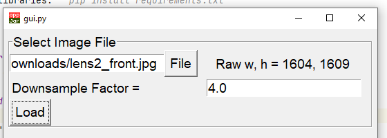

#### Select Contours
The contour selection dialog allows you to chain together multiple contours (found using OpenCV) to "lasso" an object
of interest.

- Click on the image preview in the GUI to open the contour selection dialog
- Pan around the image using W,A,S,D keys and zoom in and out using E,Q keys.
- Select contour points by clicking with the left mouse button. After your first click, as you move your mouse, a 
green preview will latch onto the closest recognized contours ("magnet mode") or connect to your previous point with a 
straight line ("straight line mode"). See recommended practices below.
- Press the C key to toggle between "magnet mode" and "straight line mode" for contour selection
- Right click to undo the previous selection.
- If you are trying to lasso a closed loop, make your last click very close to your first click.
- Press ENTER key to save selections.
- Press ESCAPE key to exit contour selection without saving changes. 
- You can click on the preview again to edit your selection at any time

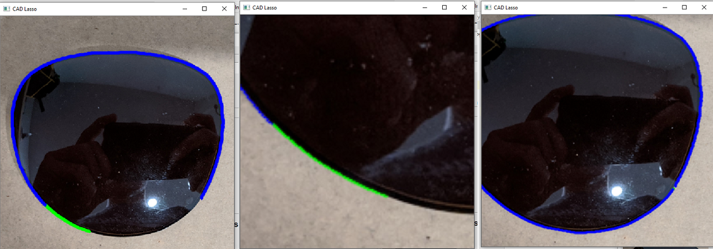
 
#### Set Scale
Set the scale to convert from pixels to real-world coordinates. You can use a caliper or a ruler to measure a dimension
that will be used for the conversion. The scale selection dialog allows you to select the dimension width in pixels

- Click on the image preview in the GUI to open the scale selection dialog
- Pan around the image using W,A,S,D keys and zoom in and out using E,Q keys. Zooming in will help you more accurately
select the dimension end points
- Select dimension end points by clicking with the left mouse button. After your first click, as you move your mouse, 
a green preview line will show you the dimension.
- Right click to undo the previous point selection
- Press ENTER key to save selection.
- Press ESCAPE key to exit without saving changes. 
- The measurement length in pixels will show up below the image
- Enter real-world length of the dimension in millimeters in the GUI
- You can click on the preview again to edit your selection at any time

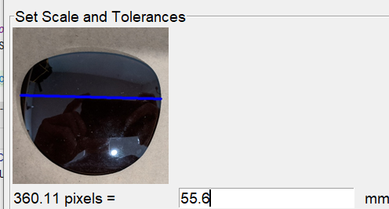

#### Add Tolerance
Adding tolerances can help to ensure that your real-world parts will fit inside of the parts you design. This is
especially useful for 3D printing. The below example shows a tolerance of 0.3mm that I used to fit a lens into my
3D printed glasses frame. This tolerance shifted all of the points outward normally from the tangent of the contour
by 0.3mm. Positive tolerances expand shapes and negative contours shrink them.

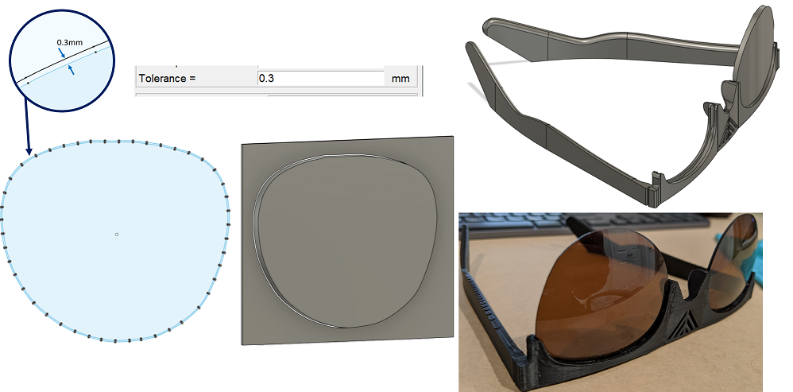

#### Save Point Data
Press the "Save" button to save the point data to a CSV file. The file will save to the "CADLasso/output/" folder with
the filename that you specify in the entry box. You can save point data as many times as you'd like so it's sometimes
a good idea to save multiple times with different tolerances so you don't need to go back and retrace later.

#### Import into Fusion 360
- Add FUSION_Import_Points.py script to Fusion 360 as shown in the image below

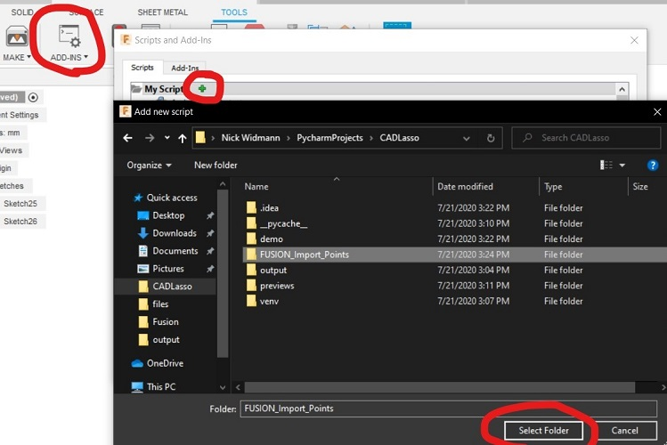

- Run the script.
- Select your .csv file saved from CADLasso Python App
- You will be prompted to select a sketch for the points/spline to be added to. Click on the sketch in the feature tree
to select.
- Edit import settings at the beginning of the FUSION_Import_Points.py file:
  - Change _SPLINE_ to True or False to set whether to connect (and close) points with a spline
  - Change _DOWNSAMPLE_ to an integer >= 1. If set to 30, then only import once every 30 points. Check the number of lines
  in your saved CSV file to see how many raw points there are. Having too many will take a long time to load (See Best
  Practices below)
  - Change _CONSTRAIN_ to True or False to set whether to add dimensions to all the points so that they are fully 
  constrained. This takes considerably more time but is very useful if you plan on importing into a design with
  existing geometry because you can move all the points around together.
  - Change _SCALE_ to a number >= 0 to set scaling. For example: 1 = no scaling, 1.5 = 150% scale, 0.5 = 50% scale.

## Recommended Practices

#### Use pictures from different directions/views
By taking multiple pictures with a top, front, and/or side view, you can better recreate 3D geometry. The following
example shows how front and side views of a scraper tool were used to build a model in just 1 extrude and 1 extrude-cut
operation.

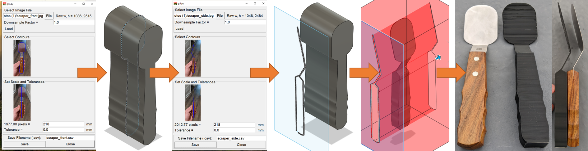

#### Preprocess Images
It will make the process much easier later on if you start by cropping, rotating, and straightening image files
before loading into CADLasso. 
Try to match the orientation you plan to use in your design.

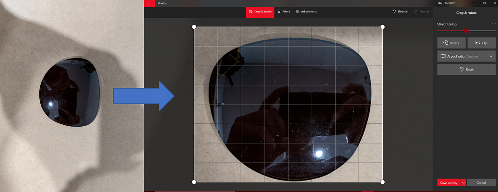

#### Downsample
Downsampling your images (either in CADLasso or beforehand) will make selecting contours and importing into 
Fusion 360 much faster. 
- Sometimes with very high resolution images, a large contour will be split into many smaller
contours which may require you to click a lot around the object perimeter. Downsampling can reduce the number of clicks
significantly. 
- Downsampling (either in the CADLasso app or later when importing into Fusion) will also greatly reduce the number of
imported points. The loading time in Fusion seems to increase exponentially as the number of imported points increases.
Try to stick to less than 50 points around an object perimeter if possible (the spline in Fusion will help fill in the
gaps), especially if including dimensions to fully constrain the points.

#### Zoom out while selecting contours
When possible, (depending on your required accuracy) zoom out while selecting contours. As you zoom in, the resolution 
of the image passed into the contour recognition algorithm will increase. You can often select longer contours quicker 
and easier by zooming out. 

#### Measure in the plane of the sketch
When setting the scale, make sure your measurement is in line in the z-direction with the plane that you plan to 
sketch on. Otherwise your measurements could become distorted due to the perspective of the camera.

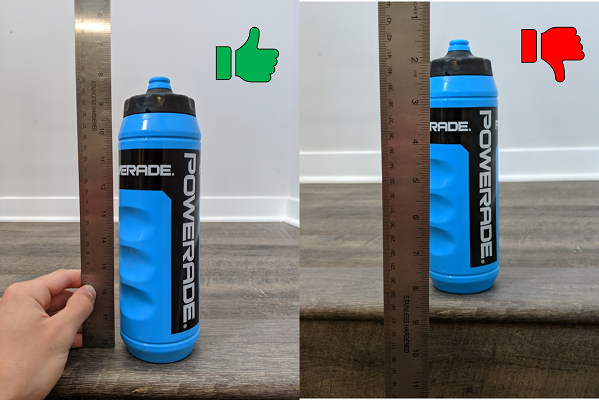

#### Don't get too close
Make sure that you are far enough away from your subject when taking your picture that the geometry is not affected
by perspective. Larger objects will require you to get further away. When taking a picture further away you can improve
the image by using a higher resolution camera (and cropping) or a long focal length lens.

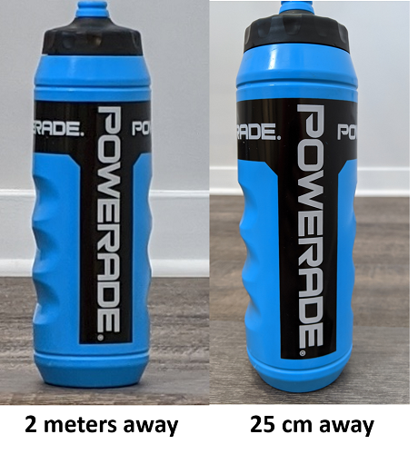

#### Tolerance is different than scaling
Scaling will increase the size of a shape by a specific percent while adding tolerance will widen/shrink a shape by a
specific amount in all directions. If you have a perfect circle, these will be the same. But for an object that is wider
than it is tall, or vice versa, they are very different.

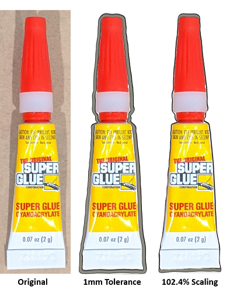

## Next Steps

- Improve contour algorithm. 
  - Better recognition
  - Connect multiple contours in a single click
- Add Fusion 360 GUI so you don't need to edit settings in the script
- Incorporate the CADLasso python GUI into Fusion 360 as an add-on so that the entire process is much more seamless and 
intuitive. This has proven difficult so far because you cannot easily import libraries (like numpy and OpenCV when 
running scripts in Fusion).